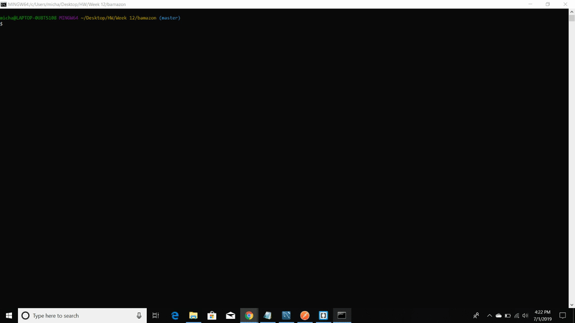

# Bamazon

# Challenge #1: Customer View (Minimum Requirement)

Running this application will first display all of the items available for sale, including the ids, names and prices of products for sale.

The app will then prompt users with two messages.

* The first asks user for the ID of the product they would like to buy.
* The second message asks how many units of the product they would like to buy.

Once the user has placed the order, the application checks if the store has enough of the product to meet the user's request.

 * If not, the app logs the phrase like `insufficient quantity`, and then prevents the order from going through.

However, if the Bamazon store does have enough of the product, the customer's order is fulfilled:
   * This means updating the SQL database to reflect the remaining quantity.
   * Once the update goes through, show the user the total cost of their purchase.

